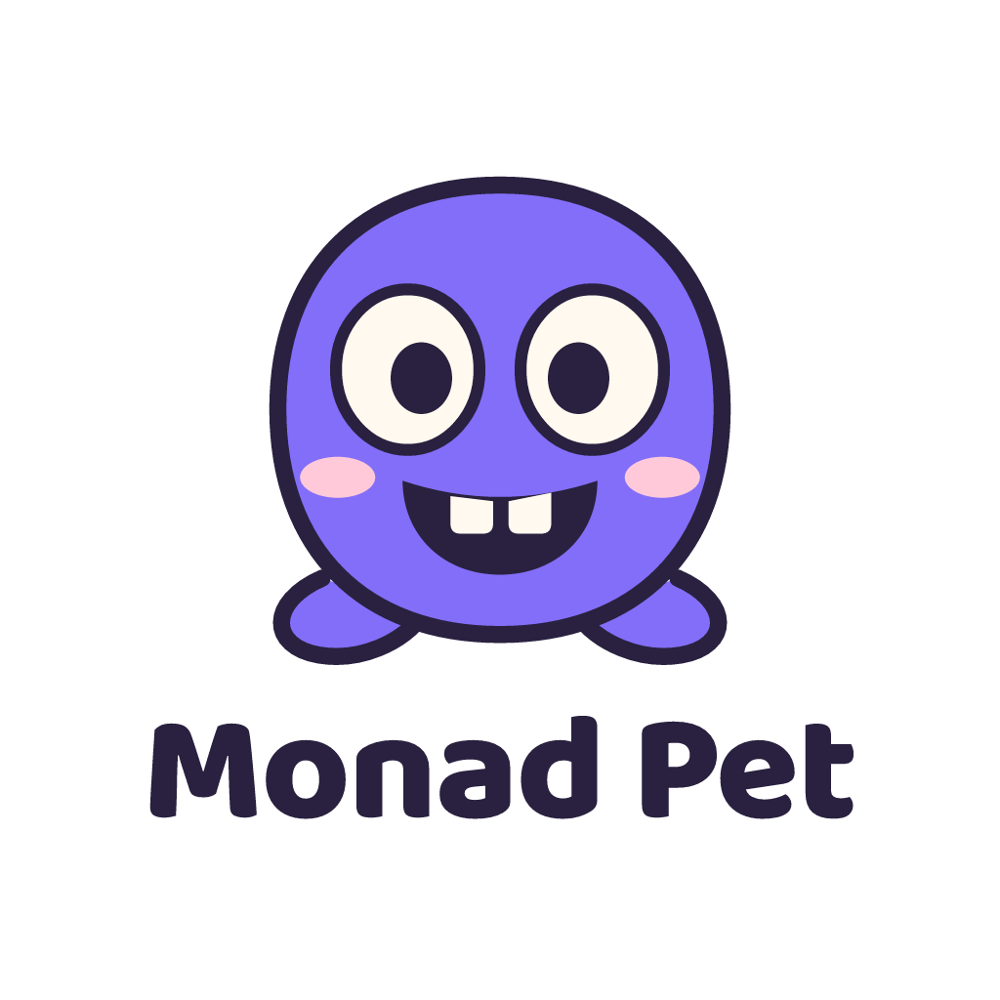
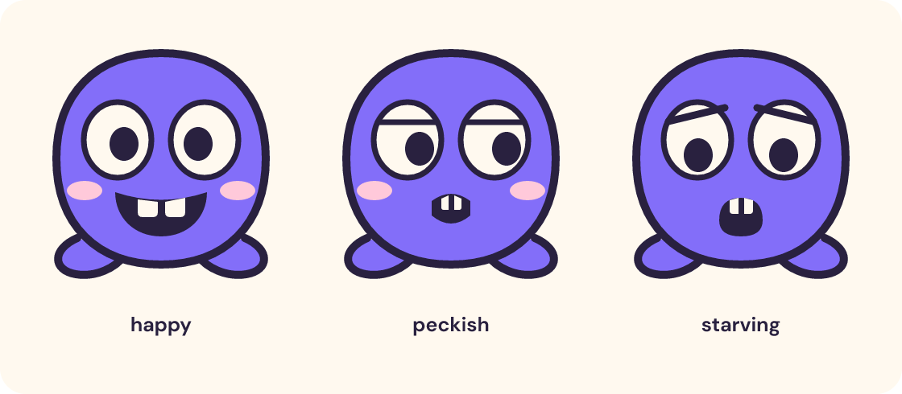

# Monad Pet

A little pet. A very big appetite.



Monad Pet is a tamagotchi that lives on Monad. Adopt it, feed it with **$CHOMP**, and keep it company. The brand is the pet: a round violet dumpling with enormous eyes, soft feet, and two blunt teeth. The simple silhouette recalls a handheld game; its expressions tell you when it needs a snack.

## Direction

Three concepts considered before drawing:

- **Two-toothed dumpling:** a round violet pet whose big eyes and two teeth make hunger readable in a tiny silhouette.
- **Pocket dragon:** a small round dragon with a curled tail, giving the world a more adventurous personality.
- **Sleepy moon blob:** a soft crescent-shaped pet whose sleepy eyes make neglect feel gently dramatic.

**Choose the dumpling.** The round body and large facial features survive the 32 px constraint, while the teeth give $CHOMP a visual cue. One image-generation call explored three dumpling silhouettes ([raster drafts](process/dumpling-drafts-1.png)); the simplest round draft informed the final hand-written SVG. The final artwork uses flat fills and original Bezier geometry. The outlined wordmark uses Baloo 2 ExtraBold.

## Palette

| Name | Hex | Role |
| --- | --- | --- |
| Monad violet | `#836EF9` | Pet body and main brand accent; keep exact |
| Ink plum | `#29213F` | Outlines, eyes, wordmark, interface text |
| Warm ivory | `#FFF9EF` | Eye whites, teeth, default light canvas |
| Blush | `#FFC9DA` | Cheeks and gentle emotional accents |
| Lilac | `#C8BCFF` | Secondary surfaces and quiet interface fills |
| Chomp gold | `#FFF0A8` | Small food and feeding accents in the interface |

Use Ink plum for body text and controls on Warm ivory, Lilac, or Chomp gold. Monad violet with Warm ivory has approximately **3.6:1** contrast: suitable for large display text, not normal-size text. A primary button can use an Ink plum fill and Warm ivory label. Purple is the pet's color in every mood; expressions, not color alone, communicate hunger.

## Type

| Use | Google Font | Weight / setting |
| --- | --- | --- |
| Wordmark and friendly display headings | [Baloo 2](https://fonts.google.com/specimen/Baloo+2) | 800; headings 1.05–1.15 line height |
| Body, controls, status labels | [DM Sans](https://fonts.google.com/specimen/DM+Sans) | 400–700; body 1.5 line height |

Use sentence case and short labels. Recommended CSS stacks: `'Baloo 2', ui-rounded, sans-serif` and `'DM Sans', system-ui, sans-serif`. The SVG wordmark and mood labels are **paths**, so viewers need no fonts installed. Keep the supplied wordmark geometry intact; use the font pairing for surrounding content. Font licenses are in [process/](process/).

## Logo usage

The main lockup stacks the pet above the words **Monad Pet**. $CHOMP is the token ticker and belongs in supporting copy, not inside the primary lockup.

- **Clear space:** define `x` as one eye's width. Keep at least `0.5x` around the mascot-only artwork, and `x` around the outer bounds of the full lockup. Measure from the visible artwork, not the SVG canvas. The canvas includes some transparent padding; add outside space where necessary.
- **Minimum digital size:** mascot **32 × 32 px**; full lockup **180 px wide**. Use the mascot asset for favicons, wallet tiles, and small avatars.
- **Minimum print size:** mascot 12 mm high; full lockup 35 mm wide.
- Display the transparent logo on Warm ivory, white, or another quiet light surface. On dark layouts, give it a light panel with the required clear space. Scale proportionally.

Do / don't:

| Do | Don't |
| --- | --- |
| Keep the round silhouette, violet body, big ivory eyes, and two blunt teeth together. | Stretch, rotate, recolor, add gradients, or rebuild the lettering with a fallback font. |
| Use the standalone mascot at 32 px, with a quiet light background and breathing room. | Shrink the complete wordmark into a favicon, crop the feet, or add tiny props and patterns. |

## Moods and voice



| Mood | Visual cue | Example copy |
| --- | --- | --- |
| Happy | Wide eyes, big two-toothed grin, rosy cheeks | “That hit the spot.” |
| Peckish | Sideways glance, flatter lids, small hungry mouth | “It has been 3 blocks since breakfast.” |
| Starving | Raised inner brows, low pupils, open mouth | “A snack would mean everything.” |

Every mood retains the same body, feet, eye size, outline, and purple. Use the three SVGs as discrete states; always pair hunger with a readable status label in the product. The voice is warm, playful, and a little dramatic. Never guilt the owner about money or imply investment returns.

## Assets and export

| File | Purpose |
| --- | --- |
| `logo.svg` | 1024-square transparent master lockup; hand-written mascot and outlined wordmark |
| `logo.png` | 1024 × 1024 RGBA export of `logo.svg` |
| `mascot.svg` / `mascot-32.png` | Standalone happy mark and actual 32 × 32 export |
| `mascot-moods.svg` / `mascot-moods.png` | Labeled 1120 × 490 three-state sheet; groups `happy`, `peckish`, `starving` |
| `mascot-{happy,peckish,starving}.svg` | Standalone 320-square assets for the product |
| `mascot-{happy,peckish,starving}-32.png` | Native-size 32 px checks of each mood |
| `process/draft-request.json` | Exact raster exploration prompt and model settings |
| `process/draft-receipt.json` | Sanitized gateway usage and cost evidence |

SVGs are the source of truth. They contain no raster image, external resource, script, or font dependency. Only the exploratory contact sheet is model-generated; PNG delivery assets are rasterized from SVG.

Re-export locally, without paid calls:

```sh
cd brand
bun install --frozen-lockfile
bun run export
```

Validated by rendering and visually reviewing the 1024 px lockup, the three-state sheet, and the actual 32 px mascot exports. At 32 px, the round violet body, paired ivory eyes, plum pupils, smile, feet, and two teeth remain distinct. The full lockup is not intended for a 32 px slot.

## Running costs

One paid image call: `openai/gpt-image-2` through **Vercel AI Gateway**, one 1536 × 1024 image at low quality containing three drafts. Gateway generation ID: `gen_01M3MS0JH1BWBF60CHMQZH55CM`. The receipt reports **USD 0.006185**, no surcharge. The on-chain testnet expense reimbursement was rounded to **0.01 mEUR**; it is separate from the worker fee. No further generation calls or compute expenses were charged.

Budget spend transaction: `0xda5a560db6bead231e74640542c8083a031db8d888b966b102fcd234855dc26d`. Of the 1.5 mEUR cap, **1.49 mEUR remains** after this expense. This is a testnet accounting record, not a fiat exchange receipt.
